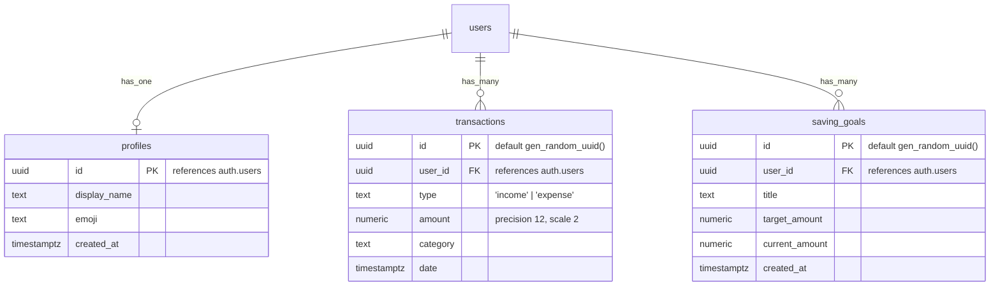

# พูนพูน (PoonPoon) 🪙

แอปพลิเคชันบันทึกเงินออมและรายจ่ายส่วนบุคคล/ครอบครัวขนาดเล็ก ด้วยดีไซน์สไตล์ **Cute & Minimal Pastel** โทนสีอบอุ่น ละมุนตา ใช้งานง่ายเหมาะสำหรับทุกเพศทุกวัย และเสริมความปลอดภัยสูงสุดด้วยระบบ Server-Side Validation และ Supabase Row Level Security (RLS)

---

## 1. ข้อมูลภาพรวมโครงการ & เทคโนโลยี (Tech Stack)

* **Core Framework**: [Next.js 16 (App Router)](https://nextjs.org/)
* **Language**: [TypeScript](https://www.typescriptlang.org/) (Strict Mode)
* **Styling**: [Tailwind CSS v4](https://tailwindcss.com/)
* **Database & Auth**: [Supabase](https://supabase.com/) (PostgreSQL + GoTrue Auth)
* **App Shell / Mobile Ready**: Progressive Web App (PWA) สนับสนุนโดย `@ducanh2912/next-pwa`
* **Data Validation**: [Zod](https://zod.dev/)

---

## 2. ตัวแปรสภาพแวดล้อม (Environment Variables)

สำหรับการรันบนเครื่อง Local หรือ Deploy บน Vercel ให้ตั้งค่าไฟล์ `.env.local` หรือ Environment Variables ดังนี้:

```env
# Supabase Configuration
NEXT_PUBLIC_SUPABASE_URL=https://your-project-id.supabase.co
NEXT_PUBLIC_SUPABASE_ANON_KEY=your-anon-public-key
```

> [!NOTE]
> แอปพลิเคชันมีระบบ **Mock Mode Fallback** อัตโนมัติ หากไม่มีการตั้งค่าคีย์เหล่านี้ ระบบจะสลับไปบันทึกข้อมูลในหน่วยความจำชั่วคราวฝั่งเบราว์เซอร์แทน เพื่อให้อินเตอร์เฟซผู้ใช้ยังสามารถเปิดแสดงตัวอย่างการใช้งานแบบสมบูรณ์ได้โดยไม่แครช

---

## 3. โครงสร้างฐานข้อมูล (Database Schema & Security)

ระบบเปิดใช้งาน **Row Level Security (RLS)** ในตารางทั้งหมดบน Supabase เพื่อควบคุมสิทธิ์ไม่ให้ผู้ใช้สวมรอยหรือสอดแนมข้อมูลของผู้อื่นได้



### สรุปนโยบายความปลอดภัย RLS Policies

1. **ตาราง `profiles`**
   * `Enable read access for all authenticated users` (สมาชิกในบ้านสามารถสืบค้นชื่อและอิโมจิของกันและกันได้)
   * `Enable insert/update for users based on user_id` (เฉพาะเจ้าของบัญชีเท่านั้นที่แก้ไขข้อมูลโปรไฟล์ของตนเองได้)
2. **ตาราง `transactions`**
   * **RLS Policy**: `auth.uid() = user_id` (ผู้ใช้แต่ละคนจะมีสิทธิ์ในการดู เขียน แก้ไข หรือลบเฉพาะแถวข้อมูลที่เป็นของตนเองเท่านั้น)
3. **ตาราง `saving_goals`**
   * **RLS Policy**: `auth.uid() = user_id` (ผู้ใช้แต่ละคนจัดการเป้าหมายการเงินของตนเองได้เท่านั้น)

---

## 4. โครงสร้างโฟลเดอร์ภายในโปรเจกต์ (Folder Structure Guide)

โครงสร้างโค้ดภายในโฟลเดอร์ `src/` ออกแบบให้แยกหน้าที่ (Separation of Concerns) ชัดเจนและอ่านง่าย:

```text
src/
├── actions/                  # Next.js Server Actions
│   ├── auth.ts              # จัดการการเข้าสู่ระบบและสมัครสมาชิกด้วย Zod Schema
│   └── transactions.ts      # จัดการ CRUD รายรับ-รายจ่าย (ทำ Auth Check & Anti-IDOR ในเซิร์ฟเวอร์)
├── app/                     # Next.js App Router Pages & Routings
│   ├── login/               # หน้าอินเตอร์เฟซการเข้าสู่ระบบ/สมัครสมาชิกพาสเทล
│   │   └── page.tsx
│   ├── globals.css          # จัดการธีมสีพาสเทลและคลาสรวมของ Tailwind CSS
│   ├── layout.tsx           # โครงสร้าง Layout หลักรวมถึงฟอนต์ภาษาไทยและ PWA Viewport
│   ├── manifest.ts          # เมตาดาต้ารูทสำหรับสร้าง manifest.json สำหรับแอปพลิเคชัน PWA
│   └── page.tsx             # หน้าแดชบอร์ดหลัก ทำหน้าที่ดึงข้อมูลจาก Server-Side
├── components/              # UI Components แยกอิสระ
│   ├── ui/                  # Reusable Atom Components (ปุ่ม, อินพุต, การ์ดพาสเทล)
│   │   ├── button.tsx
│   │   ├── card.tsx
│   │   └── input.tsx
│   ├── BalanceCard.tsx      # บล็อกแสดงยอดรวม ยอดรับ และยอดจ่ายประจำเดือน
│   ├── CategoryChart.tsx    # Donut Chart สีพาสเทลวาดด้วย SVG
│   ├── DashboardClient.tsx  # ตัวประมวลผลจัดการ Client State ของแดชบอร์ด
│   ├── DashboardHeader.tsx  # ส่วนหัวทักทายพี่ปูพูนพร้อมอิโมจิโปรไฟล์
│   ├── TransactionForm.tsx  # ฟอร์มเลือกหมวดหมู่พาสเทลและระบุยอดเงิน
│   └── TransactionHistory.tsx # รายการความเคลื่อนไหวล่าสุดภาษาไทยอ่านง่าย
├── hooks/                   # Custom React Hooks
│   └── useTransactionForm.ts # แยกตรรกะการทำงาน (Logic) ของฟอร์มบันทึก ออกจาก UI
├── lib/                     # ฟังก์ชันยูทิลิตี้พื้นฐาน
│   └── utils.ts             # ฟังก์ชันจัดการคลาส CSS ร่วมกันของ Tailwind (cn)
├── proxy.ts                 # Next.js 16 Edge Proxy (ตัวสกัดและตรวจสิทธิ์เส้นทางก่อน Render)
├── types/                   # TypeScript Types Definition
│   └── index.ts
└── utils/                   # Supabase Helpers
    └── supabase/
        ├── client.ts        # Supabase Client สำหรับฝั่ง Frontend
        └── server.ts        # Supabase Server Client สำหรับ Server Actions & Server Component
```
